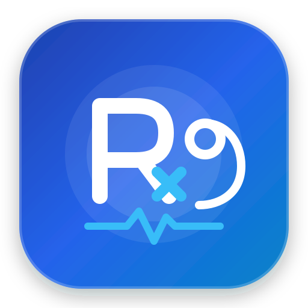

# MedScript OPD ℞

<p align="center">
  
</p>

<p align="center">
  <strong>Private, Offline-First Outpatient Prescription & Electronic Medical Records (EMR) System</strong><br>
  Built for independent physicians, outpatient clinics, and polyclinics.
</p>

<p align="center">
  <a href="LICENSE"></a>
  <a href="https://nextjs.org"></a>
  <a href="https://react.dev"></a>
  <a href="https://www.sqlite.org"></a>
  <a href="https://flatpak.org"></a>
  
</p>

---

## 💡 Why MedScript OPD?

Most modern electronic health systems lock doctors into expensive monthly cloud subscriptions, require continuous internet connectivity, and store sensitive patient records on third-party servers.

**MedScript OPD is fundamentally different:**
- 🛡️ **100% Offline & Sovereign**: All patient data, vitals, and consultation histories reside strictly on your local machine in an ACID-compliant SQLite database.
- ⚡ **Sub-Second Prescription Workflow**: Designed with real-world outpatient speed in mind. Add medications rapidly with keyboard navigation, custom dosage prefixes, and repeat prescriptions in one click.
- 🔒 **Defense-in-Depth Medical Security**: Protected by PIN authentication, brute-force rate-limiting, unattended screen auto-lock, strict POSIX 0600 file permissions, and an immutable clinical audit trail.
- 📦 **Cross-Platform Distribution**: Ready for **Linux (Flatpak & systemd)**, **Windows (Standalone App Window & Background Service)**, and **Local Clinic LAN**.

---

## 🌟 Core Clinical Features

### 1. ℞ Rapid Consultation Desk & Prescription Engine
- **Keyboard-First Workflow**: Type a drug name, configure dosage/timing, and press <kbd>Enter</kbd> to automatically open a fresh row for the next medication.
- **Brand & Generic Visual Hierarchy**: Displays the brand name in bold above with generic pharmacological composition below for maximum dispensing clarity.
- **Dosage Form Prefixes**: Automatic and selectable prefixes (`Tab.`, `Cap.`, `Inj.`, `Syr.`, `Oint.`, `Drops`, `Inhaler`).
- **Standardized Dosing Matrix**: Dosage frequencies (`1-0-1`, `1-1-1`, `SOS`), meal timing (`After food`, `Before food`), duration (`5 days`, `1 month`), and special instructions.
- **Repeat Prescription (1-Click Refill)**: Instantly clone chronic medications and past clinical advice with a single click.

### 2. 🧪 Diagnostic Lab Library (13 Panels & 48+ Tests)
- **1-Click Bundles**: Rapidly order comprehensive bundles:
  - *Diabetic Profile* (HbA1c, FBS, PPBS, Urine Microalbumin)
  - *Hypertension Panel* (Lipid Profile, Serum Creatinine, ECG, Electrolytes)
  - *Fever / Infection Workup* (CBC, ESR, Dengue NS1, Typhoid Widal, Urine Routine)
  - *Cardiac Risk Panel* (Troponin-I, CPK-MB, hs-CRP, Lipid Profile)
  - *Liver & Renal Panels* (LFT, KFT, Uric Acid, Ultrasound Abdomen)
  - *Thyroid & Arthritic Panels* (T3/T4/TSH, RA Factor, Anti-CCP, Vitamin D/B12)
- **Interactive Chip Toggles**: Add or remove individual lab tests with real-time badges.

### 3. 📈 Longitudinal Vitals & Morbidity Tracking
- **Standardized Celsius Temperature**: Clinical temperatures formatted in **°C** (with fever threshold warnings &ge; 38.0°C).
- **Interactive SVG Trend Charts**: Real-time graphing of Blood Pressure (with JNC-8 alert bands), Weight progression curves, Pulse rate, SpO2 (%), and Temperature.
- **Longitudinal Flowsheet**: Side-by-side tabular comparison of vitals and diagnoses across all past visits.

### 4. 📄 Professional PDF Letterheads & Vector Printing
- **Dynamic Letterhead Engine**: Powered by `@react-pdf/renderer` for crisp vector output.
- **Clinic Branding**: Supports high-resolution clinic logos, doctor qualifications, registration numbers, and clinic addresses.
- **Digital Rx Header & Legal Footers**: Standard medical Rx symbology, date-stamped consult details, and computer-generated prescription validity notices.

### 5. 🛡️ Enterprise Medical Data Security
- **Consultation Desk PIN Lock**: Secures the console against shoulder surfing.
- **Anti-Brute Force Rate Limiter**: Maximum 5 failed attempts triggers an automated 5-minute lockout.
- **Inactivity Screen Auto-Lock**: Automatically obscures and locks the screen after an idle period (configurable: 5, 10, 15, 30, or 60 min) with a 30-second warning countdown.
- **Hardened HTTP Headers**: Strict Content Security Policy (CSP), `X-Frame-Options: DENY`, `X-Content-Type-Options: nosniff`, and anti-caching for patient records.
- **Immutable Clinical Audit Trail**: Timestamped logging of logins, patient creations, prescription amendments, deletions, and data exports.
- **POSIX 0600 Permissions**: SQLite database files and backup snapshots are locked down so other OS accounts cannot access clinical data.

### 6. 📊 Reports & CSV Data Analytics
- Filter by date range (Today, 7 Days, Month, Year, Custom).
- RFC 4180 UTF-8 BOM CSV exports for:
  - Complete Consultation Register
  - Master Patient Directory
  - Morbidity & Diagnosis Breakdown
  - Drug Utilization & Scheduling Statistics

---

## 🚀 Quick Start & Installation

### Option 1: Linux Flatpak (Universal Linux Desktop)

MedScript OPD conforms to the Freedesktop and Flathub packaging specifications:

```bash
# Build and install Flatpak locally
./scripts/build-flatpak.sh

# Run via Flatpak
flatpak run io.github.medscript.MedScriptOPD
```
The application will appear in your desktop application menu with native icons and isolated sandbox storage.

---

### Option 2: Linux Native & Background Autostart

```bash
# 1. Run in current terminal (opens browser automatically)
./start-linux.sh

# 2. Or install as a permanent systemd background service (starts on computer boot)
./install-autostart.sh
```

To manage the background service:
```bash
systemctl --user status medscript   # Check service status
systemctl --user restart medscript  # Restart server
systemctl --user stop medscript     # Stop server
./uninstall-autostart.sh            # Remove background service
```

---

### Option 3: Windows (1-Click Standalone Desktop Window)

1. Download or clone this repository.
2. Double-click **`start-windows.bat`**.
   - Automatically initializes dependencies and opens MedScript OPD in a clean, standalone desktop application window (via Microsoft Edge or Chrome `--app` mode).
3. **Windows Startup Service**:
   - Double-click **`install-windows-service.bat`** to register MedScript OPD as an automatic startup task on Windows logon.
   - Run **`uninstall-windows-service.bat`** to remove autostart.

---

### Option 4: Clinic Local Area Network (LAN) / Tablets

Allow nursing stations, receptionists, or doctors on iPads/Android tablets to connect over clinic Wi-Fi:

- **Windows**: Run `start-lan.bat`
- **Linux/macOS**: Run `./start-lan.sh`

The launcher displays your exact local network URL (e.g., `http://192.168.1.45:3000`).

---

### Option 5: Docker Container

Deploy with Docker or Docker Compose on local clinic servers, Home Assistant, or NAS:

```bash
docker compose up -d
```
Access the desk at `http://localhost:3000`. Database and backups persist in `./data` and `./backups`.

---

## 🛠️ Developer Setup & Manual Build

### Prerequisites
- Node.js 18 or 20+ (Node.js 20 LTS recommended)
- npm 9+

```bash
# Clone the repository
git clone https://github.com/medscript/medscript-opd.git
cd medscript-opd

# Install dependencies
npm install

# Seed demo clinic data (optional)
npm run db:seed

# Start development server
npm run dev
```

### Typecheck & Linting
```bash
npm run typecheck   # npx tsc --noEmit
npm run lint        # eslint checks
npm run build       # Next.js production compilation
```

### Package Releases
```bash
# Builds .tar.gz for Linux and .zip for Windows
npm run package:release
```

---

## 🔒 Security & Privacy

For full details on data protection, offline sovereignty, and vulnerability disclosure, please read [SECURITY.md](SECURITY.md).

---

## 🤝 Contributing

Contributions are warmly welcomed! Please read our [CONTRIBUTING.md](CONTRIBUTING.md) guide before submitting pull requests.

---

## 📄 License

MedScript OPD is open-source software licensed under the **[MIT License](LICENSE)**.
