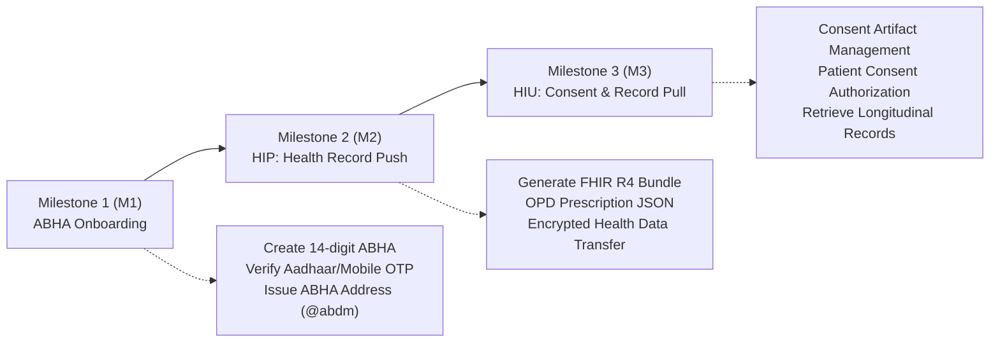

# Ayushman Bharat Digital Mission (ABDM) Integration Specification
## National Health Authority (NHA) | Government of India

This specification outlines the technical steps to certify and register **MedScript OPD** as an empanelled Electronic Medical Records (EMR) / Hospital Information System under ABDM.

---

### 1. Developer Registration
1. Navigate to the **ABDM Sandbox Portal**: [https://sandbox.abdm.gov.in](https://sandbox.abdm.gov.in).
2. Register as a **Health Facility / Healthcare Technology Provider**:
   - Organization Name: `Sonare Hospital / MedScript Healthcare Technologies`
   - Clinical Contact: `Dr. Nitin Hiralal Sonare (MBBS, Reg No: 20260201195)`
   - Contact Email: `sonarenitin3@gmail.com` | Phone: `+91 9860748963`
3. ABDM generates Sandbox API credentials:
   - `CLIENT_ID`: ABDM Client Identifier
   - `CLIENT_SECRET`: Secure client secret for generating bearer gateway tokens.

---

### 2. Certification Milestones for Empanelment

#### Milestone 1 (M1): ABHA Creation & Authentication
- Capture patient 14-digit ABHA ID and ABHA address (`name@abdm`).
- Integrate OTP authentication endpoints via ABDM Gateway.
- Store ABHA reference securely in `patients` table (`patients.abha_id`, `patients.abha_address`).

#### Milestone 2 (M2): Health Information Provider (HIP)
- Convert MedScript OPD prescriptions into **FHIR R4 Composition** bundles:
  - `Bundle.type = 'document'`
  - `Composition` resource with Clinical Findings, Diagnosis (ICD-10 / SNOMED CT).
  - `MedicationRequest` resources with drug name, dosage, frequency, and instructions.
- Provide callback endpoints for encrypted health data transfer using Diffie-Hellman Key Exchange (RFC 5114).

#### Milestone 3 (M3): Health Information User (HIU)
- Enable Dr. Nitin Sonare to raise a consent request for viewing a patient's historical records from other hospitals.
- Handle consent status notifications and decryption of incoming FHIR medical records.

---

### 3. Exit Interview & Production Empanelment
- Once Sandbox testing passes all automated test suites, request an **Exit Interview** with the NHA technical team.
- NHA issues the **Official ABDM Compliant EMR Certification** and lists MedScript OPD on the national ABDM software registry (`abdm.gov.in`).
