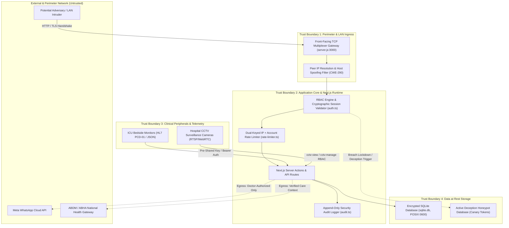

# MedScript OPD: Formal STRIDE Threat Model & SSDLC Design Matrix

**Document Standard**: Aligned with **Microsoft SDL (Design Phase)**, **NIST SP 800-218 (Task PW.1)**, and **OWASP SAMM v2.0 (Design / Threat Assessment)**.  
**System Classification**: Tier-1 Clinical Information System (Protected Health Information / PHI).  
**Architecture Model**: Offline-First Local Sovereign EMR with optional LAN Terminal Multiplexing.

---

## 1. Trust Boundaries & Architecture Data Flow

---

## 2. STRIDE Threat Analysis Matrix

| Threat Category | Target Component | Threat / Abuse Scenario | Architectural Defense & Mitigation | Code Verification |
| :--- | :--- | :--- | :--- | :--- |
| **S** - Spoofing | LAN / Loopback Ingress | Attacker spoofs `Host: localhost` or `X-Real-IP` to bypass auth when security mode is relaxed (CWE-290). | Gateway multiplexer tracks physical TCP socket remote port (`gatewayPeerMap`) and stamps `x-medscript-verified-ip`. | [`server.js`](file:///home/nitin/medscript-opd/server.js), [`auth.ts:isLocalHostRequest`](file:///home/nitin/medscript-opd/src/lib/auth.ts) |
| **S** - Spoofing | Medical Device Telemetry | Attacker transmits false vitals (e.g. SpO2 35%) to trigger ICU emergency alarms. | Enforces triple-tier auth: active clinical session (`device:telemetry`), global pre-shared key, or device-specific token. | [`/api/devices/telemetry`](file:///home/nitin/medscript-opd/src/app/api/devices/telemetry/route.ts) |
| **T** - Tampering | Prescription & Medical Records | Compromised staff account attempts to alter issued prescriptions or certificates. | Prescriptions and certificates include HMAC-SHA256 digital seals calculated from immutable clinic secret and record payload. | [`certificate-actions.ts`](file:///home/nitin/medscript-opd/src/app/actions/certificate-actions.ts) |
| **T** - Tampering | CCTV Camera Configuration | Rogue actor attempts to disable privacy masking or modify surveillance streams. | Strict RBAC (`cctv:manage` restricted to Manager/Admin; `cctv:view` restricted to authorized clinical staff) with audit logging. | [`cctv/actions.ts`](file:///home/nitin/medscript-opd/src/app/cctv/actions.ts) |
| **R** - Repudiation | Clinical Mutations & Exports | User denies accessing or exporting database records. | High-resolution append-only audit log records actor ID, role, client IP, timestamp, and action signature. | [`src/lib/audit.ts`](file:///home/nitin/medscript-opd/src/lib/audit.ts) |
| **I** - Information Disclosure | Database Backup Export | Unauthorized staff or insider attempts raw database download via API. | `/api/backup/download` requires Admin Doctor role session; if system is in lockdown, serves synthetic honeypot database. | [`/api/backup/download`](file:///home/nitin/medscript-opd/src/app/api/backup/download/route.ts), [`decoy-engine.ts`](file:///home/nitin/medscript-opd/src/lib/decoy-engine.ts) |
| **D** - Denial of Service | Login Authentication | Distributed proxy botnet rotates IPs to brute-force doctor credentials without tripping IP rate limits. | Dual-keyed rate limiting tracks both Client IP **and** Target Account key (`user:<loginId>`), locking the account on threshold. | [`rate-limiter.ts`](file:///home/nitin/medscript-opd/src/lib/rate-limiter.ts), [`login/actions.ts`](file:///home/nitin/medscript-opd/src/app/login/actions.ts) |
| **E** - Elevation of Privilege | WhatsApp API Messaging | Receptionist or nurse attempts to send arbitrary custom phishing messages via clinic WhatsApp. | Freeform messaging restricted to Doctor and CMO roles; prescription dispatches validate prescription existence. | [`whatsapp-cloud-actions.ts`](file:///home/nitin/medscript-opd/src/app/actions/whatsapp-cloud-actions.ts) |

---

## 3. Abuse & Misuse Case Specifications

### Abuse Case AC-01: Rogue Device Telemetry Injection
- **Actor**: Rogue actor connected to clinic Wi-Fi.
- **Misuse Action**: Sends HTTP POST to `/api/devices/telemetry` with corrupted ECG/SpO2 readings.
- **Expected Defense**: Endpoint validates candidate token using constant-time comparison against stored pre-shared secrets. Returns `401 Unauthorized` and records `SECURITY_ALERT_TRIGGERED` audit entry.

### Abuse Case AC-02: Distributed Password Credential Stuffing
- **Actor**: External botnet utilizing 50 distinct proxy IP addresses.
- **Misuse Action**: Sends 1 login request per IP against target account `dr_sharma`.
- **Expected Defense**: Account rate limit counter reaches 5 attempts, triggering an immediate 300-second lockout for `user:dr_sharma`, logging `AUTH_LOCKOUT` with status `WARNING`.

### Abuse Case AC-03: WhatsApp Phishing / Open Relay Abuse
- **Actor**: Compromised receptionist account or malicious script.
- **Misuse Action**: Invokes WhatsApp dispatch action with arbitrary patient phone number and malicious phishing link.
- **Expected Defense**: Action verifies that caller role has `isDoctor(role)` authority or points to a valid registered prescription in SQLite. Blocked if validation fails.

---

## 4. SSDLC Verification Traceability

All STRIDE mitigations and abuse cases are verified via automated unit and exploit tests:
- [`src/lib/__tests__/security-exploit-verification.test.ts`](file:///home/nitin/medscript-opd/src/lib/__tests__/security-exploit-verification.test.ts)
- [`src/lib/__tests__/military-security.test.ts`](file:///home/nitin/medscript-opd/src/lib/__tests__/military-security.test.ts)
- [`src/lib/__tests__/insider-security-loopholes.test.ts`](file:///home/nitin/medscript-opd/src/lib/__tests__/insider-security-loopholes.test.ts)
- [`src/lib/__tests__/mitre-threat-hunting.test.ts`](file:///home/nitin/medscript-opd/src/lib/__tests__/mitre-threat-hunting.test.ts)
